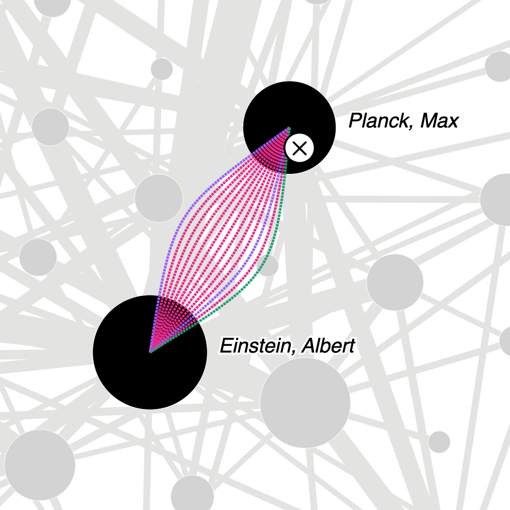
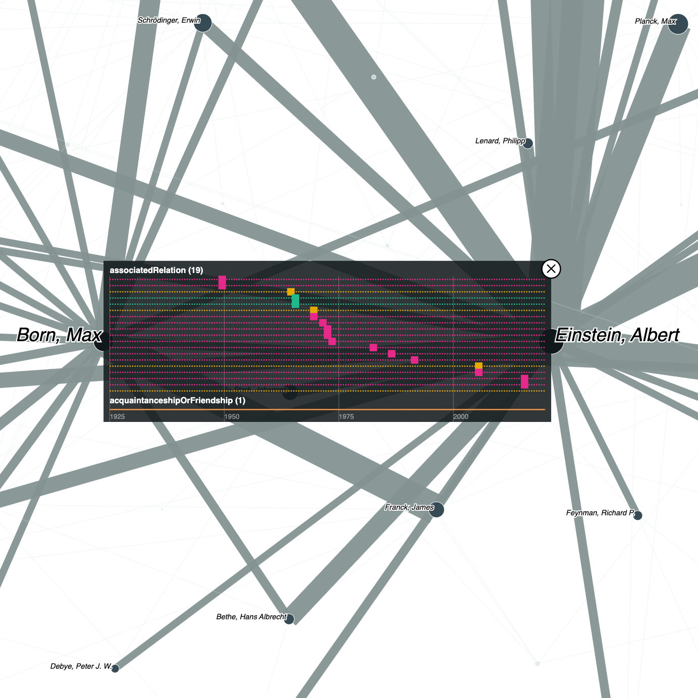
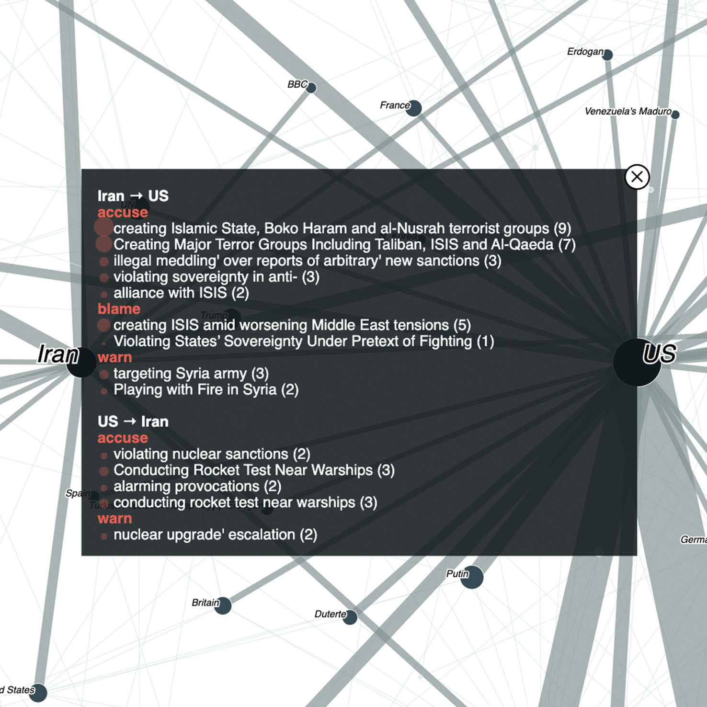

# Unfolding Edges: Adding Context to Edges in Multivariate Graph Visualization
This is a prototype implementation of »Unfolding Edges: Adding Context to Edges in Multivariate Graph Visualization« (2023) by [Mark-Jan Bludau](https://markjanbludau.de), [Marian Dörk](https://mariandoerk.de), and [Christian Tominski](https://vcg.informatik.uni-rostock.de/~ct/).

## Case Study 1: Nobelprize Network
### Edge fan-out

[Demo](https://uclab.fh-potsdam.de/unfoldingedges/nobelprize-network_v1/nobelprize-network_v1.html) | [Code](https://github.com/uclab-potsdam/unfolding-edges/tree/main/nobelprize-network_v1)

### Timeline inset

[Demo](https://uclab.fh-potsdam.de/unfoldingedges/nobelprize-network_v2/nobelprize-network_v2.html) | [Code](https://github.com/uclab-potsdam/unfolding-edges/tree/main/nobelprize-network_v2)

## Case Study 2: Conflict Network

[Demo](https://uclab.fh-potsdam.de/unfoldingedges/conflict-network/conflict-network.html) | [Code](https://github.com/uclab-potsdam/unfolding-edges/tree/main/conflict-network)

## Used libraries
The prototype is based on HTML, CSS, SVG, and JavaScript and uses the the datavisualization library [D3.js](https://github.com/d3/d3).

## Installation / Run locally
*Note: So far, the code and prototypes are not yet optimized for easy re-use and readability. We will work on this in the near future.*

In order to run the prototypes locally, due to security measures of web browsers you need to run a local web server. You can use for instace the [npm http-server](https://www.npmjs.com/package/http-server).

Install:

`npm install -g http-server`

To run the server:

`cd /localPathToYourProjectFolder`

`http-server &`

This will start the server on http://localhost:8080 from your selected directory.

